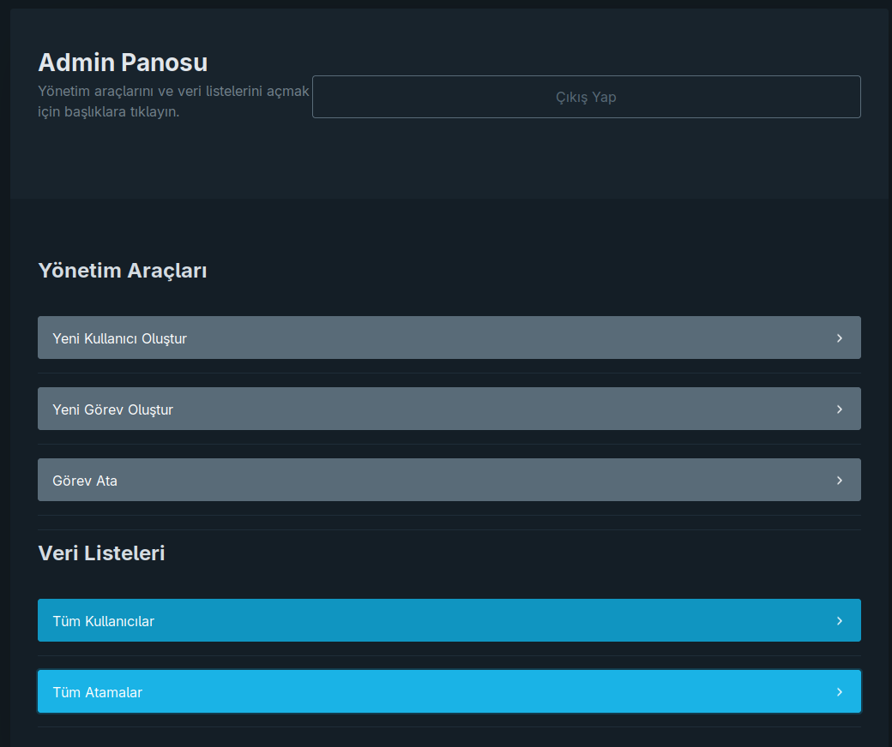
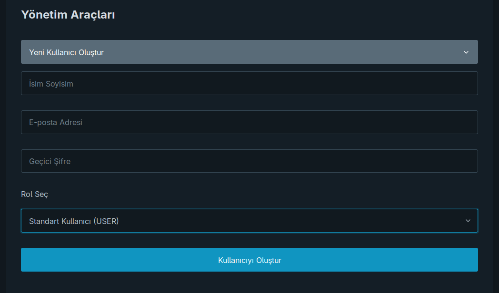
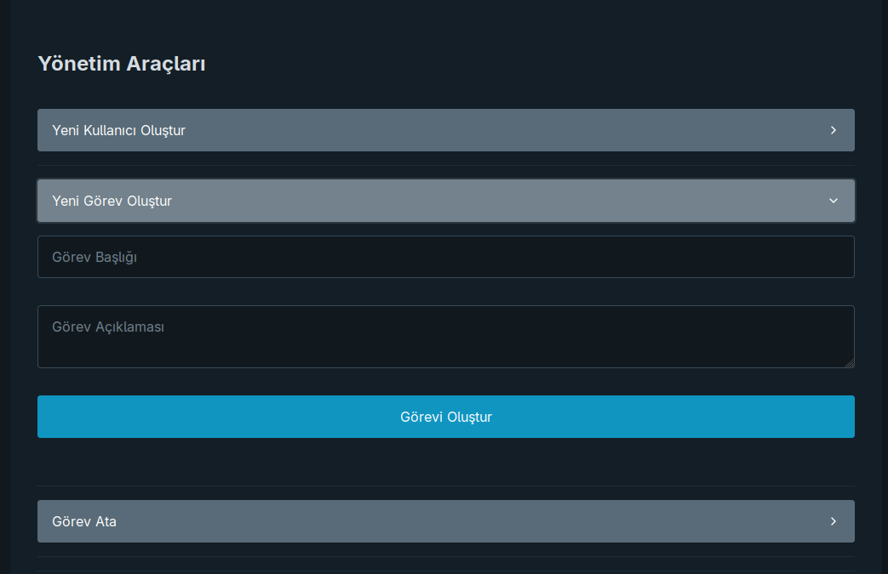
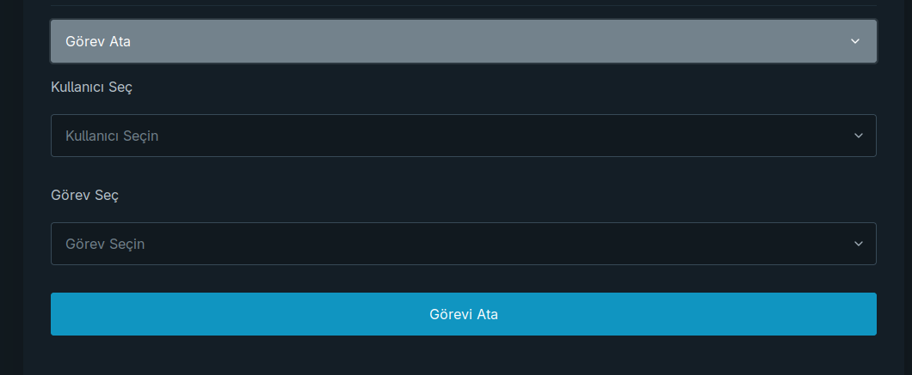
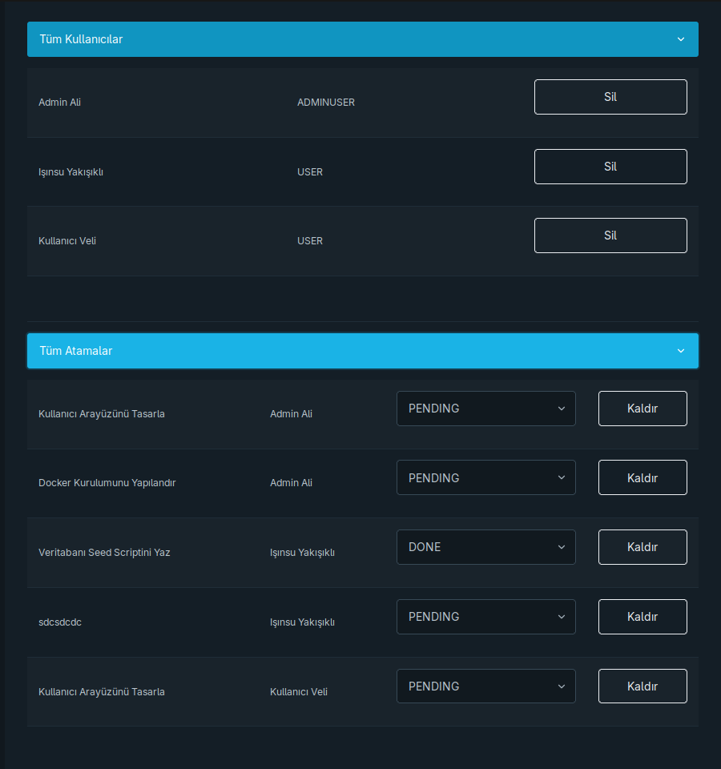

# TeamTask API 🚀

**TeamTask**, kullanıcıların ve görevlerin yönetildiği, rol tabanlı erişim kontrolüne sahip, modern ve güvenli bir görev yönetimi uygulamasıdır. Bu proje, **Node.js** ve **Express.js** tabanlı bir RESTful API, **PostgreSQL** veritabanı ve **Prisma ORM**'den oluşmaktadır. Tüm sistem, **Docker** ve **Docker Compose** kullanılarak tek bir komutla çalıştırılabilir hale getirilmiştir.

Bu proje, bir backend geliştiricisinin temel yetkinliklerini sergilemek amacıyla oluşturulmuştur: Güvenli API tasarımı, veritabanı yönetimi, kimlik doğrulama, yetkilendirme ve modern DevOps pratikleri.

## ✨ Temel Özellikler

- **Kimlik Doğrulama:** `JWT (JSON Web Tokens)` kullanarak güvenli kullanıcı kaydı ve girişi.
- **Rol Tabanlı Yetkilendirme:**
    - **Admin (`ADMINUSER`):** Tüm kullanıcıları, görevleri ve atamaları yönetebilir (CRUD operasyonları).
    - **Standart Kullanıcı (`USER`):** Sadece kendisine atanmış görevleri görüntüleyebilir.
- **Kullanıcı Yönetimi:** Adminler yeni kullanıcılar oluşturabilir, listeleyebilir ve silebilir.
- **Görev ve Atama Yönetimi:** Adminler yeni görevler oluşturabilir ve bu görevleri kullanıcılara atayabilir. Atamaları kaldırabilir ve görevlerin durumunu (`PENDING`, `IN_PROGRESS`, `DONE`) güncelleyebilir.
- **Containerization:** Tüm uygulama (Node.js API + PostgreSQL veritabanı) **Docker** ile container haline getirilmiştir.
- **Veritabanı Yönetimi:** **Prisma ORM** ile tip-güvenli (type-safe) veritabanı işlemleri, migration'lar ve veri seeding.
- **Vitrinin Arayüzü:** Backend API'sinin yeteneklerini test etmek ve sergilemek için **Vanilla JavaScript** ile yazılmış basit bir frontend arayüzü içerir.

## 🛠️ Kullanılan Teknolojiler

- **Backend:** Node.js, Express.js, JWT (jsonwebtoken), Bcrypt.js, Express-validator
- **Veritabanı:** PostgreSQL, Prisma ORM
- **Frontend:** Vanilla JavaScript, HTML5, Pico.css
- **DevOps:** Docker, Docker Compose

## 🚀 Projeyi Çalıştırma

Bu projenin en güzel yanlarından biri, Docker sayesinde tek bir komutla tüm sistemi (API + Veritabanı) ayağa kaldırabilmenizdir.

**Gereksinimler:**
- [Docker](https://www.docker.com/get-started)
- [Docker Compose](https://docs.docker.com/compose/install/) (Genellikle Docker Desktop ile birlikte gelir)

**Kurulum Adımları:**

1.  **Projeyi klonlayın:**
    ```bash
    git clone https://github.com/kullanici-adiniz/proje-adi.git
    cd proje-adi
    ```

2.  **Tüm sistemi başlatın:**
    Projenin ana dizinindeyken aşağıdaki komutu çalıştırın.
    ```bash
    docker-compose up --build
    ```
    - `--build` bayrağı, kodda yaptığınız değişikliklerle Docker imajını yeniden oluşturur.

Bu komut, PostgreSQL veritabanını başlatacak, Node.js uygulamanızın imajını oluşturacak, veritabanı tablolarını (`prisma migrate deploy`) ve test verilerini (`prisma db seed`) oluşturacak ve son olarak sunucuyu başlatacaktır.

3.  **Uygulamaya Erişin:**
    Tarayıcınızdan `http://localhost:3000` adresine gidin.

### Test Kullanıcıları

`seed` script'i tarafından oluşturulan varsayılan kullanıcılarla sisteme giriş yapabilirsiniz:

-   **Admin Girişi:**
    -   **E-posta:** `admin@example.com`
    -   **Şifre:** `admin123`
-   **Standart Kullanıcı Girişi:**
    -   **E-posta:** `user@example.com`
    -   **Şifre:** `user123`

## 📚 API Endpointleri

Tüm korumalı rotalar `Authorization: Bearer <TOKEN>` başlığı gerektirir.

| Endpoint                  | Metot  | Açıklama                                 | Yetki              |
| ------------------------- | ------ | ---------------------------------------- | ------------------ |
| `/auth/register`          | `POST` | Yeni bir standart kullanıcı kaydı oluşturur. (İsteğe bağlı) | Herkese Açık       |
| `/auth/login`             | `POST` | Kullanıcı girişi yapar ve JWT döndürür.    | Herkese Açık       |
| `/users`                  | `GET`  | Tüm kullanıcıları listeler. (`?role=...` filtresi mevcut) | **Admin**          |
| `/users`                  | `POST` | Yeni bir kullanıcı oluşturur.             | **Admin**          |
| `/users/:id`              | `DELETE` | Belirtilen kullanıcıyı siler.             | **Admin**          |
| `/tasks`                  | `POST` | Yeni bir görev oluşturur.                | **Admin**          |
| `/tasks/:id/status`       | `PUT`  | Bir görevin durumunu günceller.          | **Admin**          |
| `/assignments`            | `GET`  | Tüm atamaları listeler.                  | **Admin**          |
| `/assignments`            | `POST` | Bir kullanıcıya görev atar.              | **Admin**          |
| `/assignments/:id`        | `DELETE` | Bir görev atamasını kaldırır.             | **Admin**          |
| `/assignments/me`         | `GET`  | Giriş yapmış kullanıcının kendi görevlerini listeler. | **Giriş Yapmış Kullanıcı** |

## 🖼️ Uygulama Görüntüleri


<table>
  <tr>
    <td align="center"><strong>Giriş & Kayıt Ekranı</strong></td>
    <td align="center"><strong>Admin Yönetim Panosu</strong></td>
    <td align="center"><strong>User Ekleme</strong></td>
  </tr>
  <tr>
    <td></td>
    <td></td>
    <td></td>
  </tr>
  <tr>
    <td align="center"><strong>Task Ekleme</strong></td>
    <td align="center"><strong>Assignment Ekleme</strong></td>
    <td align="center"><strong>Veri Tabloları</strong></td>
  </tr>
  <tr>
    <td></td>
    <td></td>
    <td></td>
  </tr>
</table>